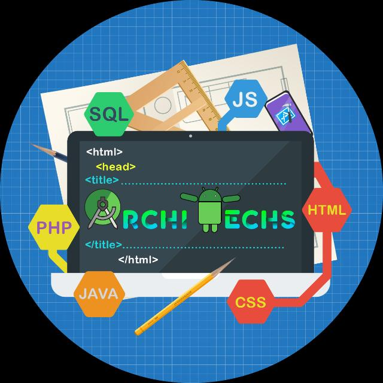

#   ArchiTechs
<base target="_blank">

  

#### This Repository Contains Implementations of Websites of Technical Clubs of IIT, Goa maintained by Architechs Club of IIT Goa.

|  Club | Link  |
|:-:|---|
|  STAB | [Website Link](https://leomajorr.github.io/ArchiTechs/STAB/index.html#home) |

## Contributors ✨

Thanks goes to these wonderful people ([emoji key](https://allcontributors.org/docs/en/emoji-key)):

<table>
  <tr>
    <td align="center"><a href="https://github.com/LeoMajorR"> <b>Ravi Prakash Singh</b></a> <a href="https://github.com/LeoMajorR/ArchiTechs/commits?author=LeoMajorR" title="Code">💻</a></td>
</table>
